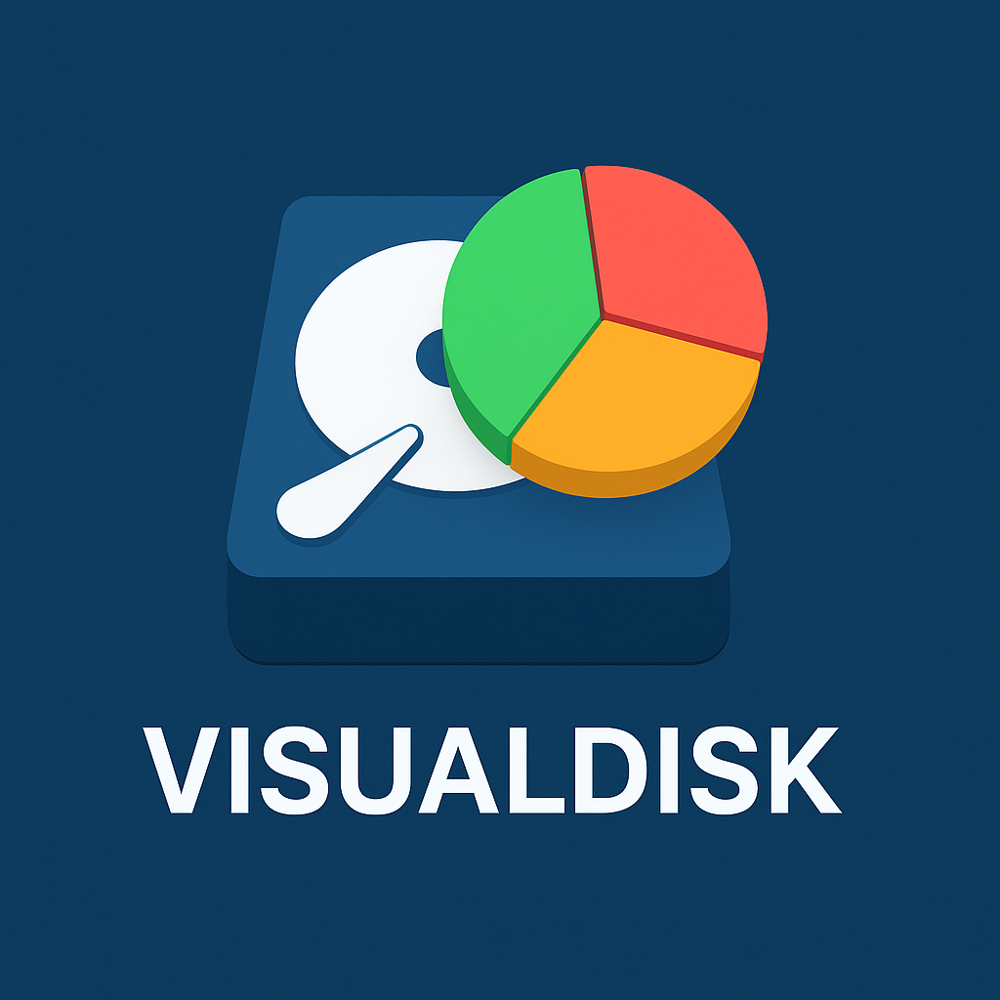
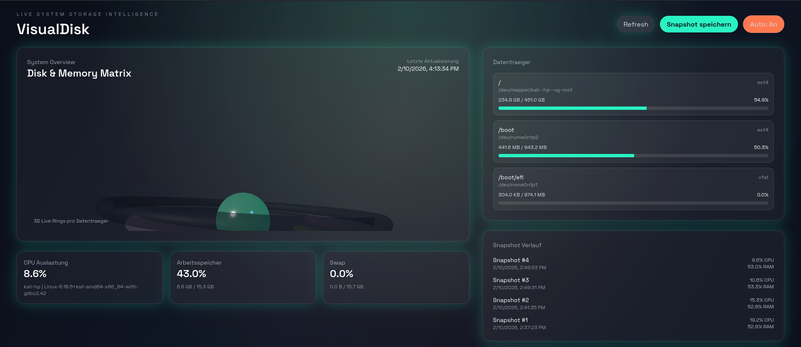

# VisualDisk

Live System Storage Intelligence: VisualDisk liefert eine hochaufgeloeste 3D-Visualisierung von Datentraegern, RAM und Swap auf Basis echter, live erfasster Systemdaten. Snapshots werden in SQLite gespeichert, um Entwicklungen und Spitzenlasten analysieren zu koennen.

[](#)
[](#)
[](#)
[](#)

## Inhalt

- [Highlights](#highlights)
- [Screenshots](#screenshots)
- [Konzept](#konzept)
- [Architektur](#architektur)
- [API](#api)
- [Datenbank](#datenbank)
- [Techstack](#techstack)
- [Setup](#setup)
- [Konfiguration](#konfiguration)

## Highlights

- Live-Erfassung von CPU, RAM, Swap, Datentraegern und IO ohne Simulationen
- 3D Ring-Stack pro Datentraeger mit Auslastung in Echtzeit
- Snapshot Speicherung fuer historische Analyse
- Nahtlose Full-Stack Integration (Frontend, Backend, Datenbank)

## Screenshots



## Konzept

VisualDisk ist als echtes Full-Stack-System konzipiert: Das Backend erfasst live Systemdaten (CPU, RAM, Swap, Datentraeger, IO) und stellt sie per API bereit. Das Frontend rendert daraus eine 3D Visualisierung und detaillierte Panels. Snapshots werden in SQLite gespeichert, um historische Analysen zu erlauben.

## Architektur

- **Backend (Flask)** sammelt Live-Daten via `psutil` und speichert Snapshots mit SQLAlchemy in SQLite.
- **Frontend (Vite + Three.js + Tailwind)** visualisiert Live-Daten in 3D und listet Details in Panels.
- **Datenfluss**: Frontend ruft `GET /api/system` fuer Live-Daten ab und `POST /api/snapshots`, um Messpunkte zu speichern.

## API

- `GET /api/health` -> Health Check
- `GET /api/system` -> Live Systemdaten inkl. Datentraeger und IO
- `POST /api/snapshots` -> Live Daten erfassen und als Snapshot speichern
- `GET /api/snapshots?limit=5` -> Letzte Snapshots fuer Analyse

## Datenbank

- **snapshots**: Zeitpunkt, Host, Plattform, CPU, RAM, Swap, Boot-Zeit
- **disk_snapshots**: Device, Mountpoint, Filesystem, Kapazitaet, Nutzung, IO

## Techstack

**Operating System**
- Ubuntu/Debian/Linux

**Frontend**
- Three.js/Node.js  --> Moderne, professionelle und detaillierte 3D Visualisierung
- Tailwind.css  --> Uplift und Finetuning

**Backend**
- Python Flask  --> Backend mit Zugriff auf Speicherkomponenten via `psutil`

**Database**
- SQLAlchemy
- SQLite3

## Setup

### Backend

```bash
cd backend
python -m venv .venv
source .venv/bin/activate
pip install -r requirements.txt
python app.py
```

### Frontend

```bash
cd frontend
npm install
npm run dev
```

## Konfiguration

- `VITE_API_BASE`: API Base fuer das Frontend, z.B. `http://localhost:5000`


